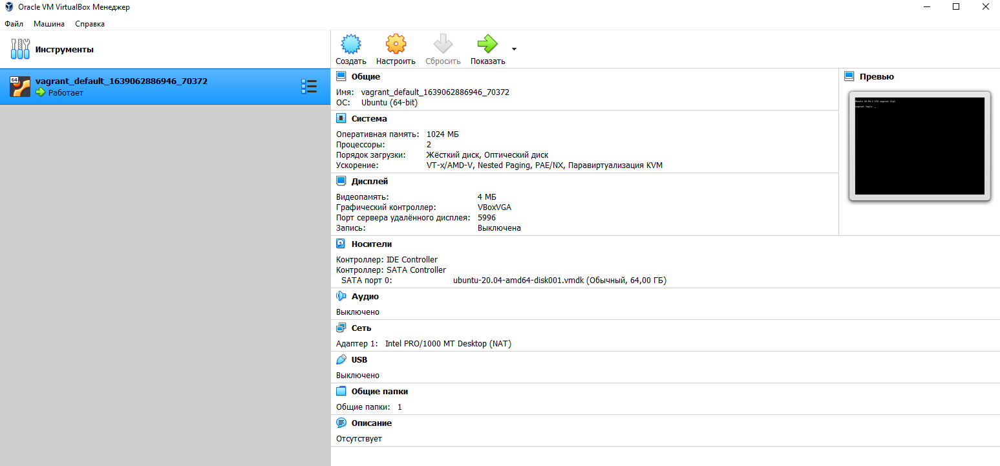
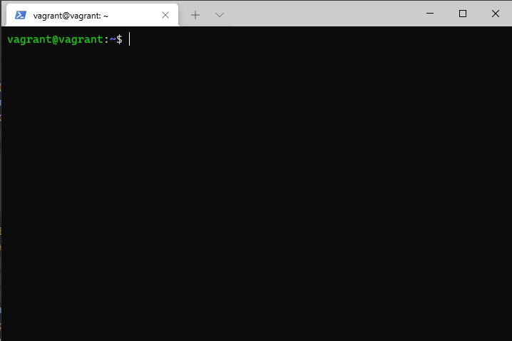
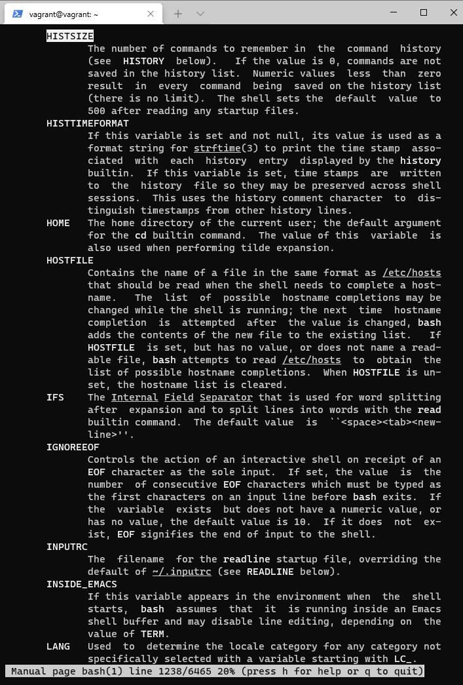
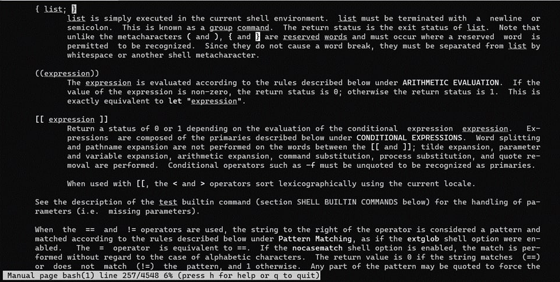
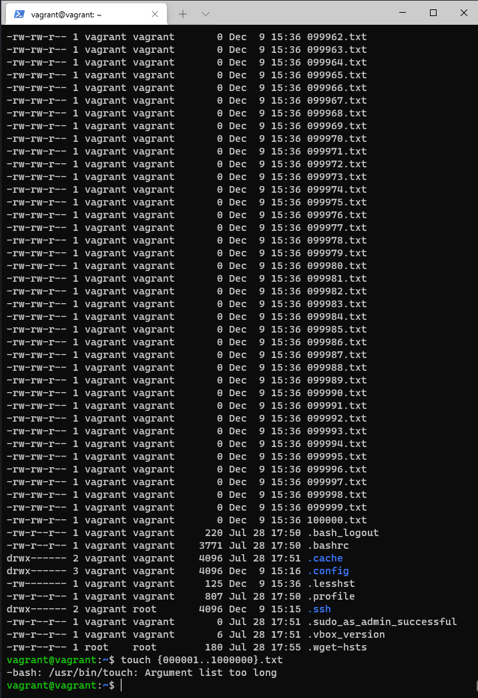
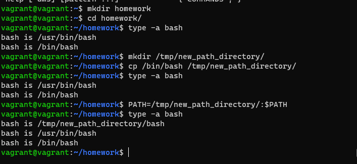

# Домашнее задание к занятию "3.1. Работа в терминале, лекция 1"

1. Установите средство виртуализации [Oracle VirtualBox](https://www.virtualbox.org/).

2. Установите средство автоматизации [Hashicorp Vagrant](https://www.vagrantup.com/).

3. В вашем основном окружении подготовьте удобный для дальнейшей работы терминал. Можно предложить:

    * iTerm2 в Mac OS X
    * Windows Terminal в Windows
    * выбрать цветовую схему, размер окна, шрифтов и т.д.
    * почитать о кастомизации PS1/применить при желании.

    Несколько популярных проблем:
    * Добавьте Vagrant в правила исключения перехватывающих трафик для анализа антивирусов, таких как Kaspersky, если у вас возникают связанные с SSL/TLS ошибки,
    * MobaXterm может конфликтовать с Vagrant в Windows,
    * Vagrant плохо работает с директориями с кириллицей (может быть вашей домашней директорией), тогда можно либо изменить [VAGRANT_HOME](https://www.vagrantup.com/docs/other/environmental-variables#vagrant_home), либо создать в системе профиль пользователя с английским именем,
    * VirtualBox конфликтует с Windows Hyper-V и его необходимо [отключить](https://www.vagrantup.com/docs/installation#windows-virtualbox-and-hyper-v),
    * [WSL2](https://docs.microsoft.com/ru-ru/windows/wsl/wsl2-faq#does-wsl-2-use-hyper-v-will-it-be-available-on-windows-10-home) использует Hyper-V, поэтому с ним VirtualBox также несовместим,
    * аппаратная виртуализация (Intel VT-x, AMD-V) должна быть активна в BIOS,
    * в Linux при установке [VirtualBox](https://www.virtualbox.org/wiki/Linux_Downloads) может дополнительно потребоваться пакет `linux-headers-generic` (debian-based) / `kernel-devel` (rhel-based).

4. С помощью базового файла конфигурации запустите Ubuntu 20.04 в VirtualBox посредством Vagrant:

    * Создайте директорию, в которой будут храниться конфигурационные файлы Vagrant. В ней выполните `vagrant init`. Замените содержимое Vagrantfile по умолчанию следующим:

        ```bash
        Vagrant.configure("2") do |config|
            config.vm.box = "bento/ubuntu-20.04"
        end
        ```

    * Выполнение в этой директории `vagrant up` установит провайдер VirtualBox для Vagrant, скачает необходимый образ и запустит виртуальную машину.

    * `vagrant suspend` выключит виртуальную машину с сохранением ее состояния (т.е., при следующем `vagrant up` будут запущены все процессы внутри, которые работали на момент вызова suspend), `vagrant halt` выключит виртуальную машину штатным образом.

5. Ознакомьтесь с графическим интерфейсом VirtualBox, посмотрите как выглядит виртуальная машина, которую создал для вас Vagrant, какие аппаратные ресурсы ей выделены. Какие ресурсы выделены по-умолчанию?

6. Ознакомьтесь с возможностями конфигурации VirtualBox через Vagrantfile: [документация](https://www.vagrantup.com/docs/providers/virtualbox/configuration.html). Как добавить оперативной памяти или ресурсов процессора виртуальной машине? 
config.vm.provider "virtualbox" do |vb|
     vb.memory = "1024"
     vb.cpu = "2"
  end
7. Команда `vagrant ssh` из директории, в которой содержится Vagrantfile, позволит вам оказаться внутри виртуальной машины без каких-либо дополнительных настроек. Попрактикуйтесь в выполнении обсуждаемых команд в терминале Ubuntu.

8. Ознакомиться с разделами `man bash`, почитать о настройках самого bash:
    * какой переменной можно задать длину журнала `history`, и на какой строчке manual это описывается?


  * что делает директива `ignoreboth` в bash?
Значение ignoreboth является сокращением для ignorespace и ignoredups . 
Значение erasedups вызывает удаление всех предыдущих строк, соответствующих текущей строке, из списка истории перед сохранением этой строки. Любое значение, отсутствующее в приведенном выше списке, игнорируется
 Значение ignoredups приводит к тому, что строки, соответствующие предыдущей записи истории, не будут сохранены.

9. В каких сценариях использования применимы скобки `{}` и на какой строчке `man bash` это описано?

Выполняется в текущей среде оболочки. 
{} - зарезервированные слова, список, в т.ч. список команд команд в отличии от "(...)" исполнятся в текущем инстансе, 
используется в различных условных циклах, условных операторах, или ограничивает тело функции, 
В командах выполняет подстановку элементов из списка , если упрощенно то  цикличное выполнение команд с подстановкой|

10. Основываясь на предыдущем вопросе, как создать однократным вызовом `touch` 100000 файлов? А получилось ли создать 300000? Если нет, то почему?

touch {000001..100000}.txt  - При большем кол-ве файлов, выдает ошибку кол-ва аргументов.
11. В man bash поищите по `/\[\[`. Что делает конструкция `[[ -d /tmp ]]` 
Возвращает статус 0 или 1 в зависимости от выражения внутри
[[ -d /tmp ]]   выражение внутри проверяет существует ли директория  /tmp
12. Основываясь на знаниях о просмотре текущих (например, PATH) и установке новых переменных; командах, которые мы рассматривали, добейтесь в выводе type -a bash в виртуальной машине наличия первым пунктом в списке:

     ```bash
     bash is /tmp/new_path_directory/bash
     bash is /usr/local/bin/bash
     bash is /bin/bash
     ```

     (прочие строки могут отличаться содержимым и порядком)
     В качестве ответа приведите команды, которые позволили вам добиться указанного вывода или соответствующие скриншоты.

13. Чем отличается планирование команд с помощью `batch` и `at`?
at - команда запускается в указанное время (в параметре)
batch - запускается когда уровень загрузки системы снизится ниже 0.8.
14. Завершите работу виртуальной машины чтобы не расходовать ресурсы компьютера и/или батарею ноутбука.

 
 ---

## Как сдавать задания

Обязательными к выполнению являются задачи без указания звездочки. Их выполнение необходимо для получения зачета и диплома о профессиональной переподготовке.

Задачи со звездочкой (*) являются дополнительными задачами и/или задачами повышенной сложности. Они не являются обязательными к выполнению, но помогут вам глубже понять тему.

Домашнее задание выполните в файле readme.md в github репозитории. В личном кабинете отправьте на проверку ссылку на .md-файл в вашем репозитории.

Также вы можете выполнить задание в [Google Docs](https://docs.google.com/document/u/0/?tgif=d) и отправить в личном кабинете на проверку ссылку на ваш документ.
Название файла Google Docs должно содержать номер лекции и фамилию студента. Пример названия: "1.1. Введение в DevOps — Сусанна Алиева".

Если необходимо прикрепить дополнительные ссылки, просто добавьте их в свой Google Docs.

Перед тем как выслать ссылку, убедитесь, что ее содержимое не является приватным (открыто на комментирование всем, у кого есть ссылка), иначе преподаватель не сможет проверить работу. Чтобы это проверить, откройте ссылку в браузере в режиме инкогнито.

[Как предоставить доступ к файлам и папкам на Google Диске](https://support.google.com/docs/answer/2494822?hl=ru&co=GENIE.Platform%3DDesktop)

[Как запустить chrome в режиме инкогнито ](https://support.google.com/chrome/answer/95464?co=GENIE.Platform%3DDesktop&hl=ru)

[Как запустить  Safari в режиме инкогнито ](https://support.apple.com/ru-ru/guide/safari/ibrw1069/mac)

Любые вопросы по решению задач задавайте в чате Slack.

---
